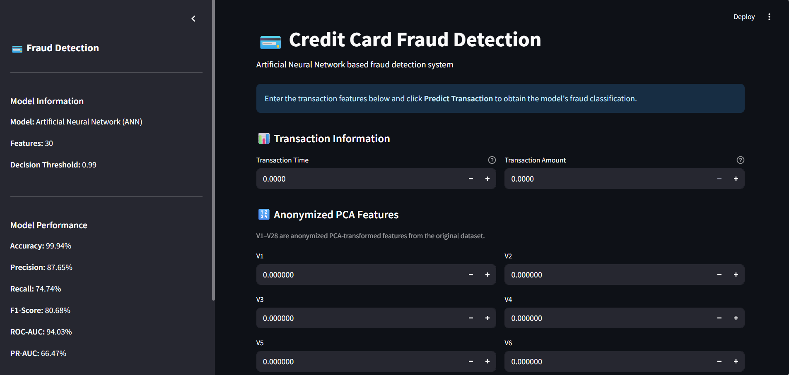
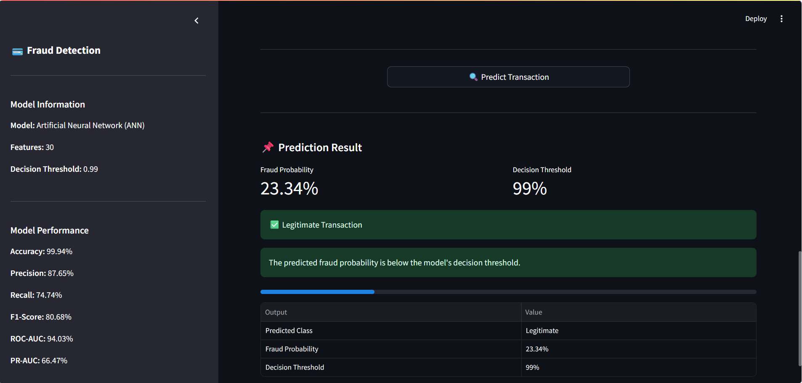

# Credit_Card_Fraud_Detection_using_Deep_Learning





## Project Overview

This project develops a Deep Learning based Credit Card Fraud Detection system using an Artificial Neural Network (ANN).

The project uses the Credit Card Fraud Detection dataset containing anonymized transaction features. The primary challenge is the severe class imbalance between legitimate and fraudulent transactions.

The project covers the complete Deep Learning workflow:

- Data loading and inspection
- Data cleaning
- Exploratory Data Analysis (EDA)
- Class imbalance analysis
- Feature distribution analysis
- Outlier analysis
- Train-validation-test splitting
- Feature scaling
- Class-weight based imbalance handling
- Baseline ANN development
- ANN tuning
- Threshold optimization
- Model evaluation
- Baseline ANN vs Tuned ANN comparison
- Model saving and verification
- Streamlit deployment

---

## Dataset

The project uses the **Credit Card Fraud Detection** dataset.

The dataset contains:

- `Time` – Time elapsed between transactions
- `V1` to `V28` – Anonymized PCA-transformed features
- `Amount` – Transaction amount
- `Class` – Target variable

Target variable:

- `0` → Legitimate transaction
- `1` → Fraudulent transaction

After removing duplicate records, the dataset contains:

- **283,726 rows**
- **31 columns**
- **30 input features**
- **1 target variable**

### Class Distribution

After data cleaning:

- Legitimate transactions: **283,253**
- Fraudulent transactions: **473**

This corresponds to approximately:

- Legitimate: **99.83%**
- Fraudulent: **0.17%**

The severe class imbalance makes accuracy alone insufficient for evaluating the model.

---

## Exploratory Data Analysis

The following EDA steps were performed:

### Dataset Inspection

- Dataset shape
- Data types
- Missing-value analysis
- Duplicate-value analysis
- Descriptive statistics

### Class Distribution

The target variable was highly imbalanced, with fraudulent transactions representing only a very small proportion of the dataset.

### Transaction Amount Analysis

The `Amount` feature showed a highly right-skewed distribution with a small number of transactions having very large values.

The distributions of transaction amounts across legitimate and fraudulent transactions showed considerable overlap.

### Time Analysis

The `Time` variable showed a non-uniform distribution across the recorded transactions.

### Anonymized Feature Analysis

The distributions of `V1` to `V28` were examined.

Additional class-wise analysis was performed for:

- V14
- V17
- V12
- V10
- V16
- V7

These features showed relatively stronger absolute correlations with the target compared with many other variables.

Correlation was used only for exploratory analysis and not interpreted as causation.

### Outlier Analysis

IQR-based analysis was used to identify statistical outliers.

The identified outliers were retained because unusual transaction patterns may contain useful information for fraud detection.

---

## Data Preprocessing

The following preprocessing steps were performed:

1. Duplicate records were removed.
2. Missing values were checked.
3. The target variable was separated from the input features.
4. The data was divided into training, validation and test sets.
5. Stratified splitting was used to preserve the class distribution.
6. StandardScaler was fitted only on the training data.
7. The same scaler was applied to validation and test data.

### Data Split

The dataset was divided into:

- Training set
- Validation set
- Test set

The test set was kept separate for final model evaluation.

---

## Handling Class Imbalance

The dataset contains a very small number of fraudulent transactions.

Instead of applying SMOTE in the ANN model, class weights were calculated using:

`compute_class_weight`

The calculated class weights were supplied during ANN training.

This gives greater importance to the minority fraud class during model training.

---

# Baseline ANN

A baseline Artificial Neural Network was developed using the following architecture:

```text
Input Layer
     ↓
Dense Layer – 64 neurons – ReLU
     ↓
Dropout – 30%
     ↓
Dense Layer – 32 neurons – ReLU
     ↓
Dropout – 20%
     ↓
Dense Layer – 16 neurons – ReLU
     ↓
Output Layer – 1 neuron – Sigmoid
```
### Training Configuration
* Optimizer: Adam
* Learning rate: 0.001
* Loss function: Binary Crossentropy
* Batch size: 256
* Maximum epochs: 30
* Class weights: Balanced
* Early stopping: Enabled
* Learning-rate reduction: Enabled

The model monitored validation PR-AUC during training.

### Threshold Optimization

Because the dataset is highly imbalanced, the default classification threshold of 0.50 was not automatically assumed to be optimal.

The validation set was used to evaluate different probability thresholds.

The threshold was selected using validation data and then kept fixed for final test-set evaluation.

The selected threshold for the Baseline ANN was:
```
0.99
```
The test set was not used to select the threshold.

### Tuned ANN

A second ANN architecture was developed to evaluate whether a more complex network could improve performance.

The tuned architecture included:
```
Input Layer
     ↓
Dense Layer – 128 neurons – ReLU
     ↓
Batch Normalization
     ↓
Dropout – 30%
     ↓
Dense Layer – 64 neurons – ReLU
     ↓
Batch Normalization
     ↓
Dropout – 20%
     ↓
Dense Layer – 32 neurons – ReLU
     ↓
Dropout – 10%
     ↓
Output Layer – 1 neuron – Sigmoid
```
The tuned ANN used:

* Adam optimizer
* Learning rate: 0.0005
* Binary Crossentropy
* Class weights
* Early stopping
* ReduceLROnPlateau

The tuned ANN was evaluated using the same independent test set as the baseline ANN


